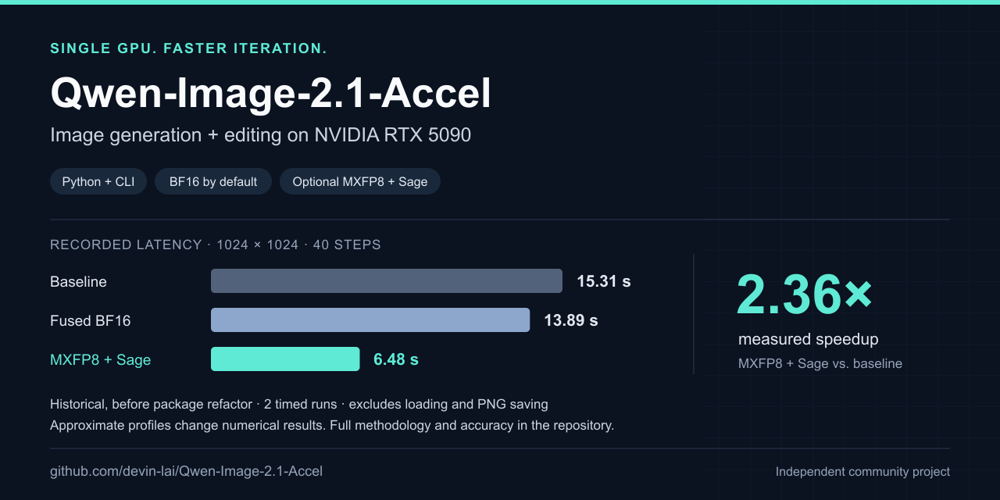

# Qwen-Image-2.1-Accel

**Faster Qwen-Image-2.1 image generation and editing on a single NVIDIA RTX 5090.**

[](docs/installation.md)
[](docs/installation.md)
[](LICENSE)
[](docs/benchmarks/README.md)

[Quick start](#quick-start) · [Benchmarks](#recorded-performance) · [Image editing](#image-editing) · [Python API](#python-integration) · [Documentation](#documentation) · [Get help](https://github.com/devin-lai/Qwen-Image-2.1-Accel/issues/new/choose)

Run text-to-image generation and reference-image editing from a **CLI or Python API**.
Start with selective BF16 Triton fusion, then opt into **MXFP8 quantization and
SageAttention2** when speed matters more than matching the baseline's pixels.
Native prefix KV caching is preserved in every profile.

[](docs/benchmarks/README.md)

> **Useful to your workflow? Give the repository a ⭐** to bookmark it and support
> continued work. Reproducible benchmark reports and contributions are welcome too.

## Why use it?

- **A practical single-GPU workflow.** Generate and edit images locally with one
  command; integrate the same pipeline into Python applications.
- **A BF16 default with measured fidelity.** `fused` matched all 12 recorded image
  and final-latent pairs exactly. That evidence covers the recorded cases only.
- **Explicit speed/accuracy choices.** At 1024 × 1024, `mxfp8_sage` recorded
  **6.48 s vs. 15.31 s** for `baseline` — **2.36× speedup**. This optional profile
  changes numerical results.
- **Evidence you can inspect.** Timings, image/latent comparisons, numerical
  replay records and reproduction commands are included.

This is an **independent community optimization project**, not an official Qwen
release. The model is [Qwen/Qwen-Image-2.1](https://huggingface.co/Qwen/Qwen-Image-2.1);
model weights are obtained separately.

## Recorded performance

**RTX 5090 · 40 steps · seed 42 · batch size 1 · lower latency is better.**

| Profile | 512 × 512 | 1024 × 1024 | 2048 × 2048 | Speedup at 1024² |
| --- | ---: | ---: | ---: | ---: |
| `baseline` | 3.97 s | 15.31 s | 82.47 s | 1.00× |
| **`fused` (default)** | **3.56 s** | **13.89 s** | **74.07 s** | **1.10×** |
| `fused_sage` | 3.49 s | 12.77 s | 58.12 s | 1.20× |
| `mxfp8_sage` | 1.83 s | 6.48 s | 33.67 s | 2.36× |
| `mxfp8_sage` + resident encoder | 1.55 s | 6.27 s | 33.57 s | 2.44× |

> [!NOTE]
> These are **historical measurements from September 21–22, 2026, before the
> package refactor**, not a fresh GPU validation of the current package.
> Each latency is the mean of two product-prompt runs after a separate two-step
> warmup. It includes text encoding, denoising and VAE decoding; model loading,
> PNG saving and network time are excluded. Speedups use the displayed latencies.

The default `fused` profile was exact on the 12 recorded image/latent pairs;
SageAttention2 and MXFP8 are approximate. The resident encoder uses additional
VRAM. PSNR/SSIM quantify similarity to the baseline, not perceptual quality.

See **[method, accuracy and reproduction commands](docs/benchmarks/README.md)**
and the [raw measurement records](docs/benchmarks/measurements.json).

## Quick start

### 1. Prepare the runtime and model

The validated environment is **Linux, RTX 5090 (32 GB / SM120), Python 3.10,
PyTorch 2.11.0+cu130 and Triton 3.6.0**. Use an isolated Python environment and
install the matching CUDA/PyTorch runtime first. A C/C++ compiler and Python
headers are needed for Triton and optional extension builds.

Obtain the [Qwen-Image-2.1 checkpoint](https://huggingface.co/Qwen/Qwen-Image-2.1)
under its own terms and keep it in a local directory. Loading is local-only;
the installer does not download weights. See the
[installation guide](docs/installation.md) for dependency and compatibility details.

### 2. Install from this repository

```bash
git clone https://github.com/devin-lai/Qwen-Image-2.1-Accel.git
cd Qwen-Image-2.1-Accel
bash scripts/install.sh

export QW21_MODEL_PATH=/path/to/Qwen-Image-2.1
```

The installer verifies and installs the bundled Diffusers wheel, then installs
this package in editable mode. **Git LFS is not needed.** The pinned wheel is
part of the validated runtime; an arbitrary public Diffusers build is not a
substitute.

### 3. Generate an image

```bash
qwen-image-accel \
  --prompt "A red ceramic teapot on a wooden table, soft window light" \
  --width 1024 --height 1024 --steps 40 --seed 42 \
  --output outputs/teapot.png
```

The default profile is `fused`. Outputs are PNG files and the output directory
is created automatically. Use `--width 512 --height 512` for a quicker first
run, `--model /path/to/checkpoint` to override the model path, and `--help` for
all options. `bash run.sh` and `python -m qwen_image_accel` expose the same CLI.

### Image editing

```bash
qwen-image-accel \
  --image input.png \
  --prompt "Change the teapot to cobalt blue, keeping the lighting and composition" \
  --steps 40 --seed 42 --output outputs/edited.png
```

Repeat `--image` for multiple reference images. Reference images determine
editing dimensions; `--width` and `--height` apply to text-to-image generation.
The timing table above measures text-to-image workloads, not editing latency.

## Choose an optimization profile

**Start with `fused`.** Try `mxfp8_sage` when you accept numerical differences
and have installed the optional SageAttention2 extension.

| Profile | When to use it | Numerical behavior |
| --- | --- | --- |
| `fused` (default) | Selective BF16 fusion on the validated runtime | Exact on the recorded cases |
| `baseline` | Reference for comparisons | Original BF16 initialization |
| `safe` | Compatible CUDA environments without the validated Triton kernels | Conservative BF16; not a CPU mode |
| `fused_sage` | BF16 weights with faster approximate attention | Approximate |
| `mxfp8`, `mxfp8_sage` | Block-scaled FP8, optionally with SageAttention2 | Approximate |
| `mxfp8_balanced`, `mxfp8_balanced_sage` | Keep six boundary blocks in BF16 | Approximate |
| `compiled`, `graph` | Explore compilation or CUDA Graph replay | Experimental; see the tuning guide |

Enable the fastest measured profile:

```bash
bash scripts/install_sageattention.sh
qwen-image-accel --profile mxfp8_sage \
  --prompt "A red ceramic teapot on a wooden table, soft window light" \
  --width 1024 --height 1024 --steps 40 --seed 42 \
  --output outputs/teapot-fast.png
```

The resident-encoder measurement additionally sets `QW21_TEXT_ENCODER=resident`;
it needs more VRAM. Compilation, CUDA Graphs and approximate step caching are
separate opt-ins. Read the [optimization guide](docs/optimization.md) for VAE
tiling, memory policies, runtime guards and accuracy tradeoffs.

## Python integration

```python
import json
from qwen_image_accel import Init, Process

# Load the model once before accepting requests.
Init(json.dumps({"model": "/path/to/Qwen-Image-2.1", "profile": "fused"}))

result, status, error = Process(json.dumps({
    "parameter": {
        "prompt": "A red ceramic teapot on a wooden table",
        "width": 1024,
        "height": 1024,
        "steps": 40,
        "seed": 42,
        "output": "outputs/teapot.png",
    }
}))
if status != 0:
    raise RuntimeError(error)
print(json.loads(result)["media_info_list"][0]["media_data"])
```

Requests are serialized around the shared pipeline. For an existing fresh BF16
`QwenImage21Pipeline`, call `configure_pipeline(pipe, "fused")` once before use.
See the [architecture and API guide](docs/architecture.md) for direct integration,
editing requests and concurrency behavior.

## Compatibility and common questions

**Will it run on another GPU, Windows or a Mac?**
The custom fused/MXFP8 kernels require the validated PyTorch/CUDA/Triton versions
and SM120 architecture. Measurements cover Linux on RTX 5090; other hardware
and operating systems have not been validated. `safe` and
`baseline` avoid those kernels but still need compatible Diffusers, CUDA and
enough memory. There is no CPU or Apple Metal inference mode.

**Does the default profile quantize the model or skip denoising steps?**
No. `fused` retains BF16 weights and native prefix KV caching. Quantization,
SageAttention2 and approximate step caching are explicit opt-ins.

**Why does initialization reject my runtime or Diffusers build?**
The fused path checks PyTorch, CUDA, Triton, GPU architecture and the transformer
source hash. Follow the [installation guide](docs/installation.md) and use the
bundled wheel. Include the full error and runtime versions when asking for help.

**Can I use this in my own application?**
Yes, subject to the project's [CPAL-1.0 license and attribution requirements](docs/licensing.md)
and the separate terms for dependencies and model weights.

## Documentation

| I want to… | Read |
| --- | --- |
| Install the runtime or set up CPU-only development | [Installation](docs/installation.md) |
| Compare speed, accuracy and memory options | [Optimization settings](docs/optimization.md) |
| Reproduce measurements or validate an optimization | [Benchmarks](docs/benchmarks/README.md) |
| Integrate the pipeline or understand the implementation | [Architecture and API](docs/architecture.md) |
| Update an older checkout or profile name | [Migration](docs/migration.md) |
| Understand redistribution and attribution | [Licensing](docs/licensing.md) |

<details>
<summary>Repository map</summary>

```text
src/qwen_image_accel/  Installable library, CLI and Python API
  kernels/            Triton arithmetic and tensor layouts
  optimizations/      Fusion, quantization and execution policies
benchmarks/           Timing, numerical replay and comparison tools
tests/                CPU tests; explicit GPU checks under gpu/
scripts/              Dependency installation and checksum verification
docs/                 Setup, architecture, tuning and recorded measurements
third_party/          Pinned Diffusers wheel and SageAttention source
licenses/             Preserved upstream license notices
```

Generated images, tensors, checkpoints, build output and caches stay outside
version control. Compact measurement records retain the evidence for the
published results.

</details>

## Help improve the project

- **Found it useful?** Star the repository and share the benchmark or installation
  guide with someone working on Qwen-Image inference.
- **Need help or found a bug?** [Open an issue](https://github.com/devin-lai/Qwen-Image-2.1-Accel/issues/new/choose)
  with your GPU, runtime versions, profile and a reproducible command.
- **Have measurements to share?** Use the [benchmark report form](https://github.com/devin-lai/Qwen-Image-2.1-Accel/issues/new?template=benchmark.yml)
  and include the configuration, warmup policy and accuracy comparison.
- **Want to contribute?** Documentation fixes, clearer errors, GPU validation and
  measured optimizations are welcome. Start with [CONTRIBUTING.md](CONTRIBUTING.md).

### Development

```bash
# In a development environment; GPU inference needs the full runtime above.
python -m pip install --no-deps -e .
python -m pip install Pillow
python -m unittest discover -s tests -v
python scripts/verify_assets.py
```

CPU tests check the adapter, profiles and entry points. GPU performance and
numerical claims require the separate [GPU validation workflow](docs/benchmarks/README.md).

## License and attribution

Project code is licensed under [CPAL-1.0](LICENSE), an
[OSI-approved license](https://opensource.org/license/CPAL-1.0). Exhibit B
requires the following attribution in applicable graphical interfaces,
including Larger Works:

> Copyright (c) 2026 Devin Lai · Powered by
> [Qwen-Image-2.1-Accel](https://github.com/devin-lai/Qwen-Image-2.1-Accel)

Section 14 exempts access without a graphical interface from the display
requirement. CPAL also requires source availability for covered code when
distributed or externally deployed, including over a network. It does not
require watermarking generated images. See [licensing](docs/licensing.md) and
[NOTICE](NOTICE); dependencies and model weights retain their own terms.

Built on [Qwen-Image-2.1](https://huggingface.co/Qwen/Qwen-Image-2.1),
[Diffusers](https://github.com/huggingface/diffusers),
[PyTorch](https://github.com/pytorch/pytorch),
[Triton](https://github.com/triton-lang/triton) and
[SageAttention](https://github.com/thu-ml/SageAttention).
